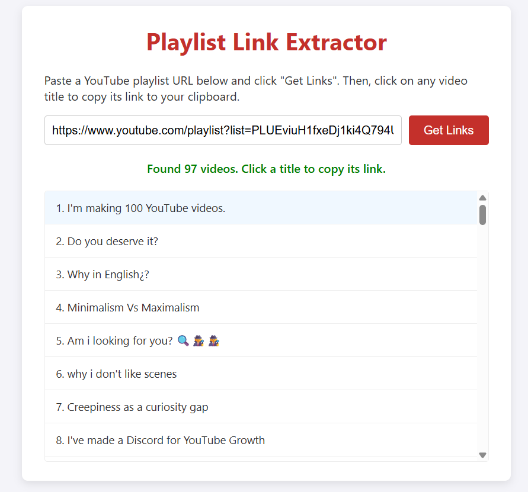

# YouTube Playlist Link Extractor

A simple, self-contained, and privacy-friendly web tool to extract all video links from a public YouTube playlist. Get a clean list of all video URLs and copy any link to your clipboard with a single click.

## ✨ Features

-   **Simple Interface:** Just paste a playlist URL and click a button.
-   **Click to Copy:** Click on any video title in the generated list to instantly copy its URL to your clipboard.
-   **Visual Feedback:** A "Copied!" message confirms that the link has been copied.
-   **No API Keys Needed:** Uses a public, privacy-focused API so you don't need to register for a Google/YouTube API key.
-   **No Backend Required:** Everything runs directly in your browser. It's a single `html` file.
-   **Portable:** Save the file and use it offline or host it easily on services like GitHub Pages.

## 🚀 How to Use

1.  **Get the file:** Download the `playlist_extractor.html` file from this repository.
2.  **Open it:** Open the `playlist_extractor.html` file in any modern web browser (like Chrome, Firefox, or Edge).
3.  **Paste your link:** Find a public YouTube playlist and copy its URL. Paste it into the input box.
    -   Example URL: `https://www.youtube.com/playlist?list=PLUEviuH1fxeDj1ki4Q794UV-WKcoHR42A`
4.  **Get Links:** Click the "Get Links" button.
5.  **Copy!** The list of video titles will appear. Just click on any title to copy the full video link.

## ⚙️ How It Works (The Technical Part)

This tool is built with vanilla HTML, CSS, and JavaScript.

A web browser's security rules (**CORS Policy**) prevent a script from one domain (like your local file) from requesting data from another domain (like `youtube.com`). Trying to scrape YouTube directly would fail.

To get around this, the tool uses a clever, two-step process:

1.  **Piped API:** Instead of scraping YouTube, it sends a request to a public instance of **Piped** (`pipedapi.kavin.rocks`), a privacy-friendly YouTube frontend. Piped provides a clean JSON response with all the playlist information, without needing an official API key.

2.  **CORS Proxy:** Sometimes, even public APIs restrict requests that come from a local file (`origin: null`). To solve this, the request to the Piped API is routed through the **AllOrigins** CORS proxy. This proxy fetches the data on our behalf and adds the necessary headers to the response, satisfying the browser's security policy.

The data flow looks like this:
`Your Browser` → `AllOrigins Proxy` → `Piped API` → `AllOrigins Proxy` → `Your Browser`

This approach ensures the tool works reliably without complex setups or security vulnerabilities.

## 💡 Potential Future Improvements

-   [ ] Export the entire list as a `.txt` file.
-   [ ] Show video thumbnails and durations next to the titles.
-   [ ] Add a "Copy All Links" button.
-   [ ] Implement a dark mode toggle.
-   [ ] Option to format the copied link (e.g., as Markdown).

---

## Project Genesis & A Note on AI Collaboration

This project is a practical example of modern human-AI collaboration. Here's a look at how it was built:

1.  **The Idea & First Draft:** The initial concept and requirements were given to Google's Gemini 2.5 Pro (Preview) in AI Studio. The AI generated the first version of the HTML, CSS, and JavaScript, including the core logic to fetch playlist data.

2.  **The First Bug:** The initial AI-generated code immediately hit a real-world roadblock: a **CORS (Cross-Origin Resource Sharing) error**. The API endpoint it chose had security policies that blocked requests from a browser, a common issue the initial code didn't account for.

3.  **Human Debugging & Refinement:** This is where human oversight was critical. I diagnosed the CORS issue and directed the solution: implementing a CORS proxy (`AllOrigins`) to correctly mediate the API request. This step was essential to making the tool functional.

4.  **Final Polish:** From there, I guided the final development, including:
    *   Correcting factual errors made by the AI (even about its own identity!).
    *   Improving the user feedback messages.
    *   Creating this comprehensive `README.md` file and project structure.
    *   Choosing and executing a deployment strategy on Netlify.

This tool demonstrates how AI can serve as a powerful 'pair programmer' for rapid prototyping, with a human developer providing the crucial direction, real-world testing, and problem-solving skills needed to build a polished and working final product.

## 📄 License

This project is open-source and available under the [MIT License](LICENSE). See the `LICENSE` file for more details.
